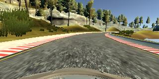
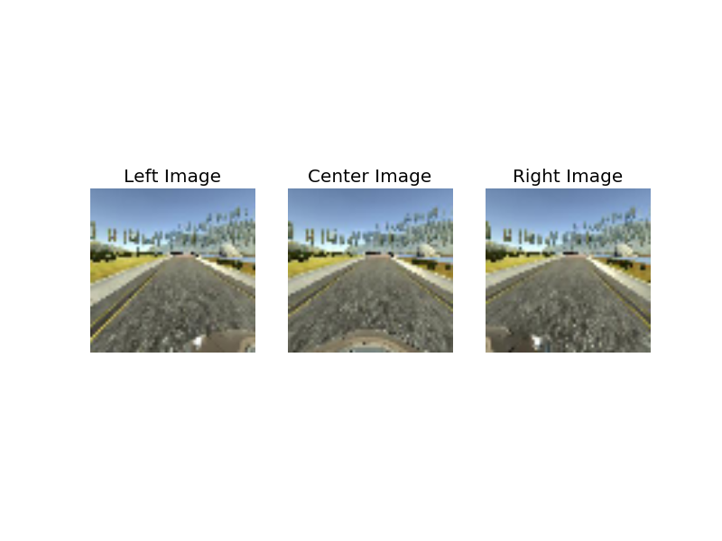
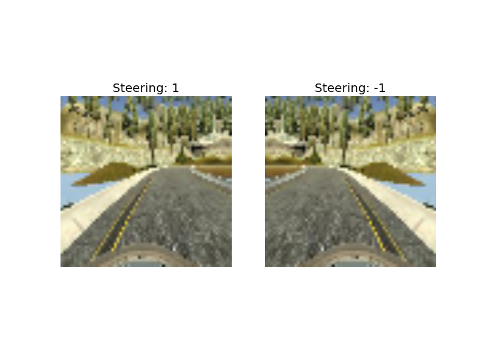

# Behavorial Cloning

## I) Overview

The main goal of this project is to drive a car in a simulator and then use deep learning to teach it to drive itself.

To achieve this goal, we will:

- Drive the car in the simulator and record images taken from the center, left and right side of the dashboard with the associated steering angles
- Process and augment this data to have more data points
- Train a Convolutional Neural Network on this data
- Use the model and weghts obtained to let the car drive itself arround the track

## II) Installation

### Features

For this project, I used Python 3 with libraries Numpy, Tensorflow, Keras, OpenCV, Matplotlib.

All these libraries are in the Anaconda Environment provided by Udacity. To install this environment, please follow the instructions [here](https://github.com/udacity/CarND-Term1-Starter-Kit/blob/master/doc/configure_via_anaconda.md).

### The Simulator

You can download and install the simulator from [here](https://d17h27t6h515a5.cloudfront.net/topher/2016/November/5831f290_simulator-macos/simulator-macos.zip).

## III) Usage

### The Simulator in Training Mode

Open the simulator you previously intalled and select a resolution and graphics (I used the lowest resolution and fastest graphics for computational power reasons).

Select a track and hit **Training Mode**. You'll enter the simulator and be able to drive the car with the arrow keys.

### The Simulator in Autonomous Mode

Open the simulator you previously intalled and select a resolution and graphics (I used the lowest resolution and fastest graphics for computational power reasons).

Select a track and hit **Autonomous Mode**. The car will just sit there untill your Python server connects and provide steering angles. Here is how you start your Python server:

- Set up your development environment with Anaconda
- Run the server: `python drive.py model.json`

## IV) The DATA

### Collecting Raw Data

To collect data, you should launch the simulator in **Training Mode**. Then, hit the record button in the top right corner to start recording. Now drive a few laps and hit the record button again to stop recording.

If everythong went correctly, you should see the following in the directory you selected:

- An `IMG` folder containing the pictures taken by the simulator
- A `driving_log.csv`file where each row contains the paths of the center, left and right images, the associated steering angle, and the throttle, break and speed

Since we want to teach our car how to stay in the middle of the road, we should first drive and record a few laps in the middle of the road. 

But that is not enough: if we only teach the car what to do when it is in the middle of the road, it won't know what to do if it ever wanders off on one side of the road.

So we need to teach the car what to do when it’s off on the side of the road, *training for recovery*: we should put the car on a side of the road, start recording, drive it back to the center of the road and stop recording.

**Remark**: The simulator is very hard to use with a keyboard. This is why I used only the data provided by Udacity that you can find [here](https://d17h27t6h515a5.cloudfront.net/topher/2016/December/584f6edd_data/data.zip).

Here is an example image and associated steering angle:

Steering angle: 0.1765823

Here is the distribution of steering angles:

The distribution of steering angles shows that most images have a steering of 0 (driving straight) and that there is a bias towards turning left (most turns on track 1 are left turns).

Moreover, we can see that the steering angles are comprised between -1 and 1.
 
### Splitting the data

To avoid overfitting, we are first going to split the data in 3 sets: Train, Validation and Test.

The training data will be used to train our model and define our weights. The validation data will be used to compare the different models we train and fine tune our parameters. Finally, once we have chosen a model based on the different results on our validation set and train it on our training set, we will test it on our test data that our model has **NEVER** seen. Otherwise, we would overfit.

Since the simulatior in Autonomous Mode only use center images to define steering angles, our test set will only contain center images. But because we want our test data never to be seen by our model before testing, once a center image is in the test set, the corresponding left and right images are discarded : they cannot be put in the training or validation set (so they will not be used at all).

Also, we don't want our validation and training set to overlap. So, a center image will always be in the same set as its corresponding left and right images: the same situation cannot produce a center image in the validation set and a right or left image in the training set.

For the training and validation set, we will use the left and right images to have more data points to train on. For these left and right images, we need to adjust the steering angle. By trial and error, I fine tuned this parameter to 0.2: we will add 0.2 to the steering angle for the left image (we are more on the left side of the track so we need to steer more to the right) and substrack 0.2 to the existing steering angle for the right image.

Note that given the fact that we have a lot of images with a steering of 0 (driving straight in the middle of the road) and that we do not want to have a distribution of steering angles with 3 peaks (one at 0, one at 0.2 and one at -0.2), we only use the left and right images if the original steering angle is <> 0. Otherwise, the car might have a tendency to always steer at 0.2 and -0.2.

Here is an example of a left, center and right image of the same situation:

We choose to do a 70/15/15 split on the center images. Moreover, since we will train our model by batches of 128 pictures, we choose our sets so that they have a number of images that is a multiple of 128.

Obviously, the split is done randomly (no consecutive images) and we shuffle these sets.

### Preprocess the data

Before being used by our model, the data is preprocessed:

- First we resize it to 64x64 images (from 320x160)
- Then we normalize it

The resizing is done when we load the data, so the function `resize_image` needs to appear also in the `drive.py` file:
	
	image_array = resize_image(image_array)

But the normalization is the first layer of our model, so it will not appear explicitely in the file `drive.py`.
	
	model.add(Lambda(lambda x: x/255 - 0.5, input_shape=(64,64,3)))

### Data Augmentaion

We will now augment our data to have more points to train on.

We will first horizontally flip each image (like in a mirror) and affect it the opposite of the original steering angle:

This will help by doubling our sample of images and by correcting the bias towards turning left.

We will also shift each image horizontally by a random number of pixel (from -15 to 15 pixels), and modify the associated steering angle by 0.05 per pixel shift. This parameter was fine tuned by trial and error thanks to our validation set:

 We will apply 3 random shifts per image.

### The Generator

Since there is a lot of data (training set of 84736 images of size 64x64x3), we cannot load it all in memory. So we use a batch generator that will load, resize and augment the data on the fly only when it is needed. This means that we will have only 128 images (the batch size) in memory at every moment.

## V) The Model

### The Architecture

The architecture I used twas inspired by [this paper](http://images.nvidia.com/content/tegra/automotive/images/2016/solutions/pdf/end-to-end-dl-using-px.pdf) written by the team at Nvidia.

The first layer is a Normalization layer: it performs image normalization before the image enters the Neural Network.

The second layer is a 1x1 convolutional layer. Because of the 1x1 shape of this layer, it will be trained on single pixels and so will not take into account any pattern in the image (it won't detect lines, edges, ...). This means that training this layer is kind of training a new color space that will be more adapted than RGB.

This is followed by 5 convolutional layers with ELU activation: the first 3 convolutional layers are of size 5x5 with stride 2x2, and the other 2 are of size 3x3 without stride. These convolutional layers were designed to perform features extraction and were chosen by the Nvidia team empirically through a series of experiment.

The convolutional layers are followed by 3 fully connected layers and a layer that outputs the final result which is the steering angle. To avoid overfitting, I added dropout layers between these layers and regularizers. These fully connected layers were designed to function as a controller for steering (they use the features extracted by the convolutional layers to compute the steering angles).

So the final architecture of the model is:

- A `Normalization` layer
- A `1x1x3 convolutional` layer to *learn a new color space*
- A `5x5x24 convolutional` layer with 2x2 stride and same padding
- A `ELU` activation layer
- A `5x5x36 convolutional` layer with 2x2 stride and same padding
- A `ELU` activation layer
- A `5x5x48 convolutional` layer with 2x2 stride and same padding
- A `ELU` activation layer
- A `3x3x64 convolutional` layer with 1x1 stride and same padding
- A `ELU` activation layer
- A `3x3x64 convolutional` layer with 1x1 stride and same padding
- A `flattening` layer
- A `dropout` layer with dropout probability of 20%
- A `fully connected` layer of size 100 with weight regularization
- A `dropout` layer with dropout probability of 50%
- A `fully connected layer` of size 50 with weight regularization
- A `dropout` layer with dropout probability of 50%
- A `fully connected` layer of size 10
- A `fully connected` layer of size 1

### Training the model

The model is trained to minimize the mean squared error on the steering angle thanks to an Adam Optimizer:

    model.compile(optimizer='adam', loss='mse')

Once the model architecture was decided, the weights were trained on the (augmented) training data set. Then the model was evaluated on the (augmented) validation dataset. This training and evaluation process was repeated multiple times with different sets of hyperparameters in order to fine tune them. After some trials and errors, I fine tuned my parameters to:

- Shift in steering for left and right images: `shift_steer=0.2`
- By how much we multiply the size of the training and validation sets when we translate the images by a random amount of pixels in augmentation: `multiplier=4`
- Shift in steering per pixel we translate the image: `shift_per_pix=0.05`
- Number of epoch (I found that more epochs does not make the model perform better): `nb_epoch=10`

The main difficulty here was to find parameters that would augment the data enough and find the correct steering shifts to train the car for recovery without overfitting the data.

Given the complexity of the model and the size of the data, it should be trained on a GPU. I used AWS to train my model. It takes approximately 80 seconds per epoch, so 15 minutes in total to train my model.
	
	python model.py
	
The architecture of the model is saved in `model.json`and the weights in `model.h5`.

## VI) The Result

Once the model is trained, we can test it in the simulator. I have slightly changed the `drive.py` code:

- I added the resize function
- I modified the throttle so that the more steering I have, the less throttle I have `throttle = 0.1 * (1-abs(steering_angle))`

<video controls>
  <source src="Result.m4v" type="video/mp4">
</video> 

In this simulation, the car is still jittery some times and overlaps with the line before coming back to the middle of the road. One possible way of improvement would be to have more recovery data (by the simulator or by augmentation). An idea would also be to have extreme steering angle when approaching the edges of the road to be sure not to overlap the lines (this would mean that the `shift_per_pix` parameter could depend on the distance to the edges of the road).